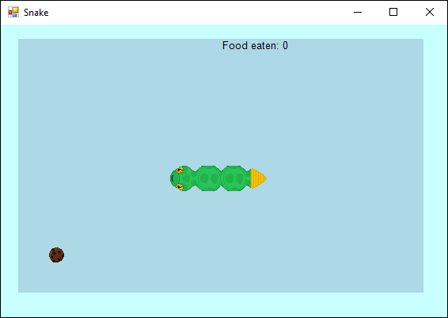

# Windows Forms - Snake

  

## About
A small 2D Snake Game project written in pure C# using Windows Forms.

## Download and Installation
To get this project:

* Install Visual Studio Community 2019
* Install .NET Framework 4 - 4.6 development tools
* Clone the repo: `git clone https://github.com/Avalin/wf_snake.git`

That's it.

## Usage

Open the project in Visual Studio Community 2019, and run the application from `GameWindow.cs`
